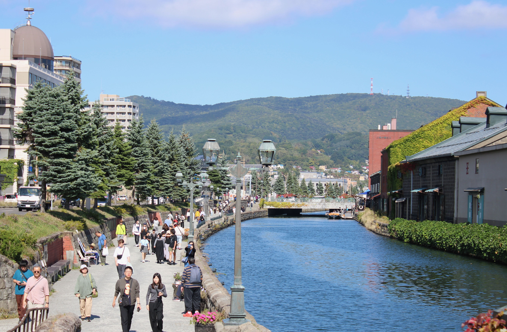

```{r setup, include=FALSE}
library(knitr)
library(tidyverse)
library(leaflet)

opts_chunk$set(echo = FALSE)
```

# About

The **1st International Conference on Glottometry** (GlottoConf1) is a conference dedicated to the measurement of distance (the quantifiable degree of dissimilarity) between linguistic varieties. It will be held in hybrid mode in **Otaru, Japan**, on **26--28 July 2027**.

# Plenary speakers

{width=30%}

[**Szeto** Pui Yiu](https://pyszeto.wixsite.com/home) (University of Hong Kong)

TBA

{width=30%}

[Hedvig **Skirgård**](https://sites.google.com/site/hedvigskirgard) (Max Planck Institute for Evolutionary Anthropology)
 
**Between Clusters and Continua: A Tour of Tools for Lect Comparison**

When comparing languages, there are many different tools at our disposal and considerations to take into account. In this talk, I showcase some powerful methods for exploring language dissimilarity (neighbour-nets, cultural fixation scores, tests of phylogenetic signal and dimensionality reduction techniques) as well as highlight some important aspect such as the underlying assumptions of these tools, feature dependencies and feature selection.
 
# Call for papers

We call for oral presentations on ongoing or recently completed studies on **glottometry**, the measurement of distance between linguistic varieties.

The distance can be at any linguistic level (between "languages" or "dialects") and in any domain, including:

 * Acoustic distance
 * Articulatory distance
 * Phonological distance
 * Lexical distance
 * Semantic distance
 * Morphological distance
 * Syntactic distance
 * Visual/graphic distance
 * Perceived distance
 * Geographical distance
 * Intra-familial distance
 * Inter-familial distance
 * Cross-modal distance

Please send a 2-page abstract (including everything) in the following format:

* A4 paper
* 2.5cm margin
* 12pt Times New Roman
* pdf

Please send your anonymized abstract to [joo@res.otaru-uc.ac.jp](mailto:joo@res.otaru-uc.ac.jp). It will then be reviewed by two anonymous reviewers.

**The deadline is 31 March 2027**. Decisions will be communicated to you on a rolling basis within two weeks after the submission (and not necessarily after the deadline). We thus encourage you to submit as soon as your abstract is ready so that you can plan your trip well in advance.

# Format of the conference

GlottoConf1 is a hybrid conference featuring both on-site and online presentations.

The language of the conference is English. Live captions in English will be provided during the presentations.

# Participation fee

The participation fee is 5,000 Japanese yen for student presenters and 10,000 yen for non-student presenters. It is free for non-presenting auditors.

The fee is waived for participants studying or working at an institution in a low-income or lower-middle-income country (as defined by the [World Bank](https://datatopics.worldbank.org/world-development-indicators/the-world-by-income-and-region.html)).

# Venue

GlottoConf1 will be held at the [Otaru University of Commerce](https://english.otaru-uc.ac.jp), located in Otaru, Japan.

```{r}
OUC <- tibble(
  name  = "Otaru University of Commerce",
  lat   = 43.1911,
  lon   = 140.9791,
  Color = "red",
  popup = "<b>Otaru University of Commerce</b>"
)

leaflet(data = OUC) %>% 
  addTiles() %>% 
  addCircleMarkers(lng = ~lon, lat = ~lat,
             color = ~Color,
             fillColor = ~Color,
             popup = ~popup) |> 
  setView(lng = 140.9791, lat = 43.1911, zoom = 5)
```


# About Otaru

{width=100%} {width=100%}

Otaru is a small coastal city in Hokkaido, the northernmost prefecture of Japan. It is a popular tourist destination consistently rated as one of the most attractive Japanese cities. 

The [Otaru Ushio Festival](https://www.visit-hokkaido.jp/en/event/detail_11009.html) is held at the end of July every year, which the participants of GlottoConf1 may also be able to enjoy.

The nearest airport is New Chitose Airport (CTS), which has connections to several major Asia-Pacific cities.